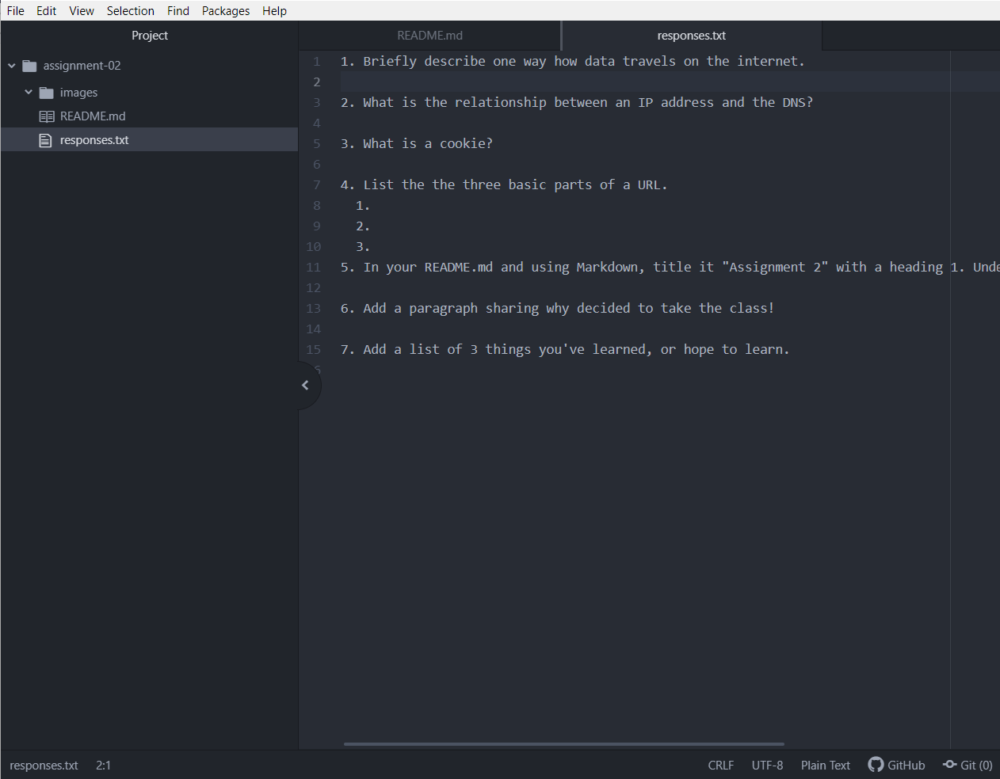

# Assignment 2
## Avery Schakosky

I decided to take this class because it's a requirement for my degree in Media Arts, but also because I've always been interested in web design. I used to look at old websites versus new/up-to-date ones and admire the differences in quality, uses, and design. I've always found the internet's ever-developing system to be really cool, and I've always wanted to figure out how it works and maybe even be a part of it. Especially when it comes to web design specifically, I always have critiques about designs and aesthetics about pretty much anything design-related, and I think it would be really look to better understand how web design works and eventually be able to work with it myself. It's just another form of artistry that I'd like to tackle.

## Things I've Learned/Want to Learn
1. I've learned how the internet in connected around the world via cables.
2. I've learned how data is gathered and transferred from one device to another.
3. I can't wait to learn more about HTML coding; it's one of the forms of coding that I'm most interested in.

## Links & Things
### Frequently Used Site
https://www.deviantart.com/
### Responses.txt Link
[Responses](./responses.txt)
### Homework Screenshot

