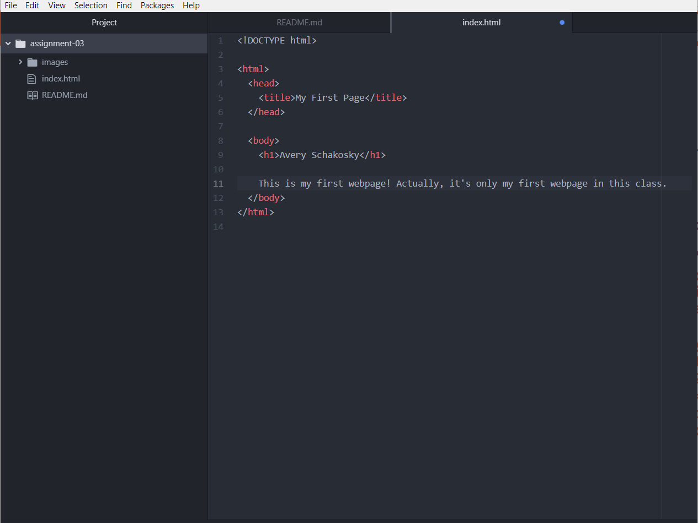

### Responses
1. Very briefly detail how browsers function. List any browsers you currently use to surf - or even develop for - the web.
The process of using a browser starts out with you sending a request to a server. Said server responds by providing a collection of web content that fits within your request. Your browser then interprets the content and displays the proper page.

Some browsers I use include Firefox, Ecosia, and Brave.

2. What is a markup language? Describe one commonly used in development.
A markup language is a system that dictates the architecture of a page, and if often focused on the text content. One that is commonly used is one that we'll be learning about in this class, HTML.

### Screenshot

