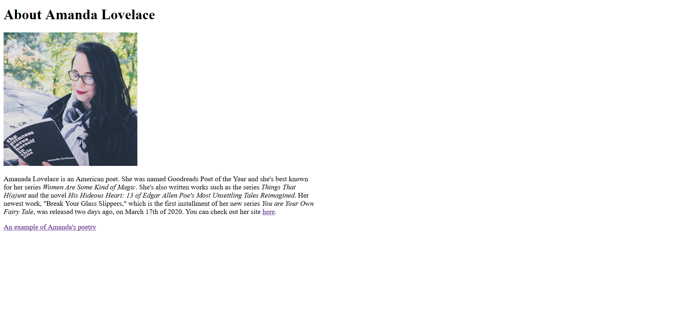

1. Visit a site using The Wayback Machine, looking at a snapshot at least 10 years old. Where did you go? What did it look like? How has it changed?

I chose to check out DeviantArt with The Wayback Machine. Even in the past couple of years, it's changed a lot, so I thought it would be fun to remember what it looked like back when I first started using the site. Within the past couple years, DeviantArt has been updating and upgrading to a new visual format called Eclipse, which very few people who use the site are a fan of. Eclipse is black and very sleek, but they're still figuring out the font styles and details because the fonts are currently chunky and blocky, and the organization isn't amazing. Before Eclipse, DeviantArt always had a greenish gray color scheme and nice organization. However, on June 19th of 2010, DeviantArt was missing a lot of the icons and stylistic details it currently has, and the main page only had a page-by-page scrolling system; currently, the site now has three different scroll options. The logo for the site is also different, which is the face of their Deviant mascot, rather than the "DA" logo the site now has.

2. Summarize your experience with the GIT Module. What did you learn? What was difficult, easy, or still misunderstood?

I understand the GIT module fairly well, but mainly because I've used it before during previous classes. I've had an issue here and there with it this week, mainly regarding linking my index.html and about.html together, and I need to get a bit more organized using it, but other than that, it's a nice tool.

3. An embedded image of your screenshot using its relative URL.

