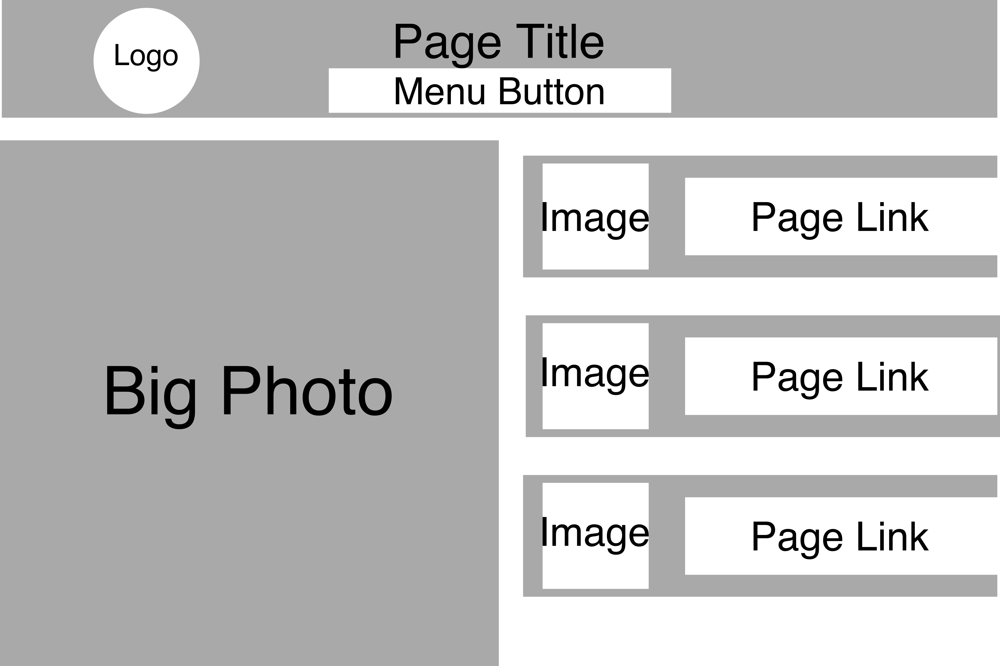

1. What is the difference between padding, margin, and borders?

Padding is the amount of space between the element and the content within it. Margins are the space between one element and another. Borders are physical borders that can be made around an element.

2. Embed the image of your sketch.

3. Free Response: Summarize your work cycle for this assignment.

After the initial setup, I gathered some media that I wanted to include in this piece, including images, fonts, and a logo I made myself; now that I've finished the project, I realize the fonts aren't as complimentary as I thought, but I thought they were at the time of getting them. After that, I created the styles for the main body element. From then on, I skipped back and forth between the index and styles pages as I worked on things. I started out the "header of the page," which consisted of the page title and logo; I went back after finishing everything else and added the menu. Then I worked on adding the image element; it was kind of a pain to place it where I wanted it to be and have it sized properly, but I eventually got there.

Originally, in my sketch, I'd wanted to make three product buttons with images. However, once I started working on the assignment, I kept picturing an area of text above one product button. I settled on this idea instead, and made the text area to my liking and with filler text. I still created a product button, but slightly simplified and under said text area. After I was done tweaking things, I moves on to answering questions. 
